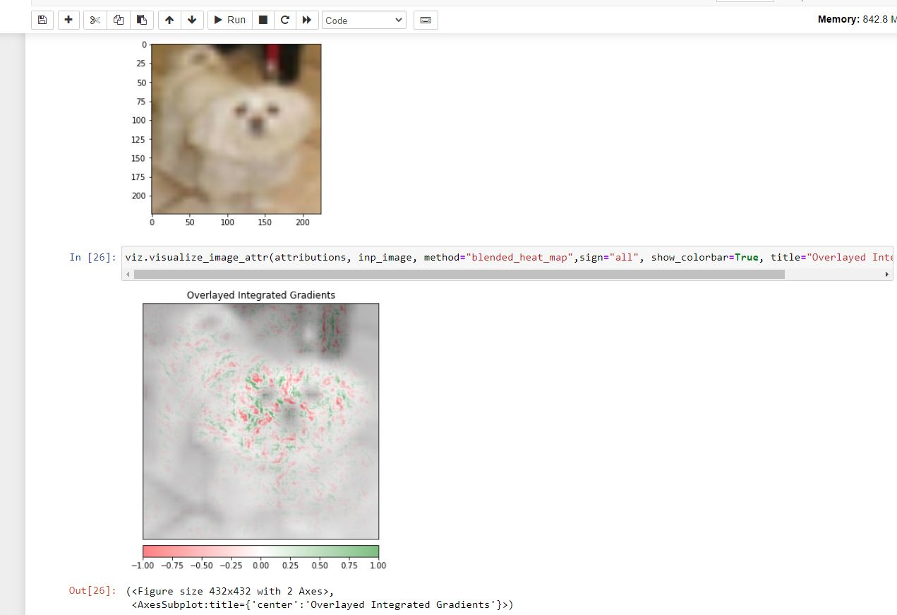
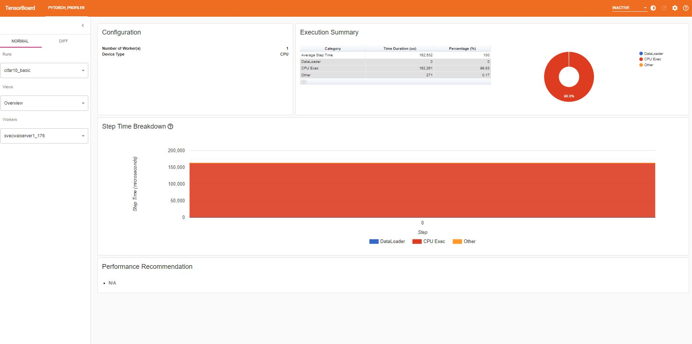
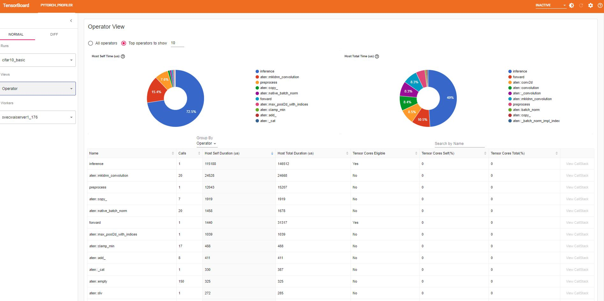
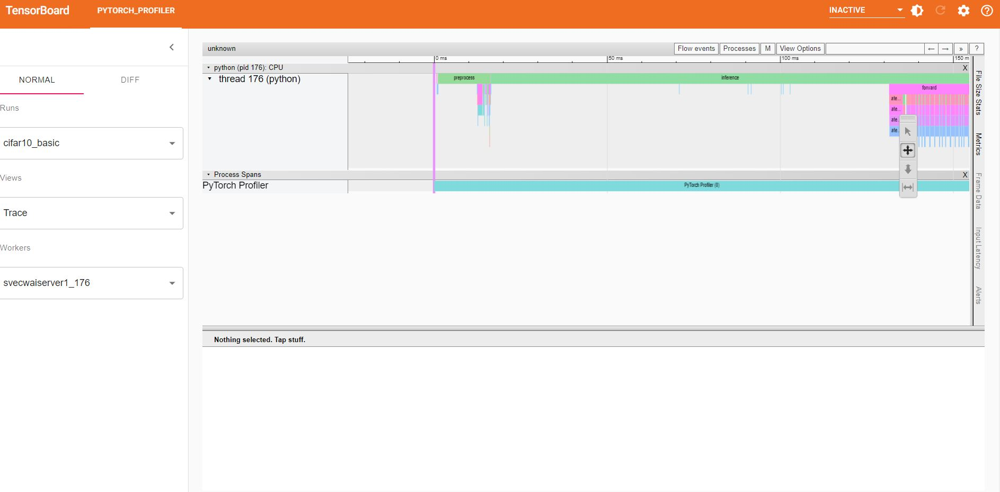

<h1>1) Output of pytest test_serve</h1>

========================================================= test session starts ==========================================================
platform linux -- Python 3.9.7, pytest-7.1.2, pluggy-1.0.0
rootdir: /home/jupyter-vit_abhinav/Narasimha/emlov2-session-08, configfile: pyproject.toml
plugins: hydra-core-1.2.0, anyio-3.6.1
collected 1 item

test_serve/test_serve_cifar_REST_API.py::TestCIFAR::test_predict PASSED                                                          [100%]

========================================================== slowest durations ===========================================================
1.99s call     test_serve/test_serve_cifar_REST_API.py::TestCIFAR::test_predict

(2 durations < 0.005s hidden.  Use -vv to show these durations.)
========================================================== 1 passed in 2.06s ===========================================================

<h1>2)Model Explanation Image</h1>

<h1>3)Inference metrics</h1>

# HELP ts_queue_latency_microseconds Cumulative queue duration in microseconds
# TYPE ts_queue_latency_microseconds counter
ts_queue_latency_microseconds{uuid="77d609f1-7a63-4cdd-922c-7c06c4ec17fd",model_name="cifar",model_version="default",} 416.079
ts_queue_latency_microseconds{uuid="77d609f1-7a63-4cdd-922c-7c06c4ec17fd",model_name="cifar",model_version="1.0",} 10895.285999999998
# HELP ts_inference_latency_microseconds Cumulative inference duration in microseconds
# TYPE ts_inference_latency_microseconds counter
ts_inference_latency_microseconds{uuid="77d609f1-7a63-4cdd-922c-7c06c4ec17fd",model_name="cifar",model_version="default",} 167474.595
ts_inference_latency_microseconds{uuid="77d609f1-7a63-4cdd-922c-7c06c4ec17fd",model_name="cifar",model_version="1.0",} 6393579.788999999
# HELP ts_inference_requests_total Total number of inference requests.
# TYPE ts_inference_requests_total counter
ts_inference_requests_total{uuid="77d609f1-7a63-4cdd-922c-7c06c4ec17fd",model_name="cifar",model_version="default",} 1.0
ts_inference_requests_total{uuid="77d609f1-7a63-4cdd-922c-7c06c4ec17fd",model_name="cifar",model_version="1.0",} 40.0

4) Tensorboard images
 
 
